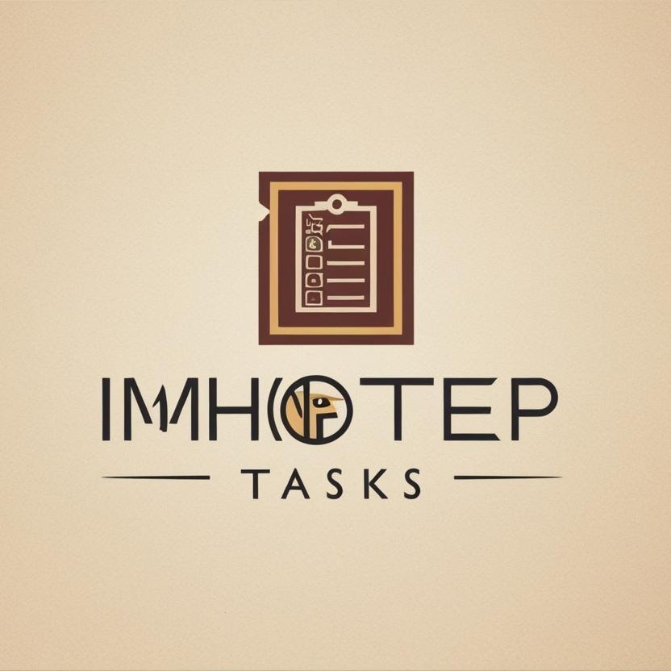

# Imhotep Tasks ✅

<div align="center">
  
  <br>
  <h3>Streamline Your Productivity, Simplify Your Life</h3>
</div>

## 🚀 Overview

Imhotep Tasks is a modern, intuitive task management system designed to help individuals organize, prioritize, and track their daily tasks with ease. With a clean, responsive interface and powerful features, Imhotep Tasks makes staying productive simpler than ever.

## ✨ Features

- **Task Management** - Create, organize, and track tasks with custom categories and priorities
- **Deadline Management** - Set due dates and never miss important deadlines 
- **User Authentication** - Secure account system with customizable user profiles
- **Responsive Design** - Seamless experience across all devices and screen sizes
- **Background Sync** - Create tasks offline that automatically sync when you're back online

## 🖥️ Platform Support

### Web Application
Access Imhotep Tasks from any modern browser at [Imhotep Tasks](https://imhoteptasks.pythonanywhere.com)

### Desktop Applications (Coming Soon)
Native desktop applications built with Electron:
- 🪟 Windows
- 🍎 macOS
- 🐧 Linux

## 🛠️ Tech Stack

- **Frontend**: HTML, CSS (Tailwind CSS), JavaScript
- **Backend**: Django (Python)
- **Database**: Relational Database System
- **PWA Features**: Service Workers, IndexedDB
- **Desktop Apps**: Electron

## 🚀 Getting Started

### Prerequisites
- Python 3.8+
- pip

### Installation

```bash
# Clone the repository
git clone https://github.com/Imhotep-Tech/imhotep_tasks.git
cd imhotep_tasks

# Create and activate virtual environment
python -m venv venv
source venv/bin/activate  # On Windows, use: venv\Scripts\activate

# Install dependencies
pip install -r requirements.txt

# Apply migrations
python manage.py migrate

# Run development server
python manage.py runserver
```

Visit `http://localhost:8000` in your browser to access the application.

## 📱 Progressive Web App

Imhotep Tasks is available as a Progressive Web App. When visiting the application in a supported browser, you'll be prompted to install it on your device for offline access.

## 🔮 Future Plans

- Mobile apps for iOS and Android
- Team collaboration features
- Calendar integration
- Advanced analytics and reporting
- More customization options

## 🤝 Contributing

Contributions are welcome! Feel free to submit issues or pull requests.

## 📄 License

Imhotep Tasks is licensed under the MIT License. See the LICENSE file for more information.

## 👥 About Imhotep Tech

[Imhotep Tech](https://imhoteptech.vercel.app) is dedicated to developing innovative software solutions that enhance productivity and simplify complex workflows.

---

<div align="center">
  <p>Designed with ❤️ by Imhotep Tech</p>
  <p>
    <a href="https://github.com/Imhotep-Tech">GitHub</a> •
    <a href="https://x.com/Imhoteptech1">Twitter</a> •
    <a href="https://www.instagram.com/imhotep_tech">Instagram</a>
  </p>
</div>

